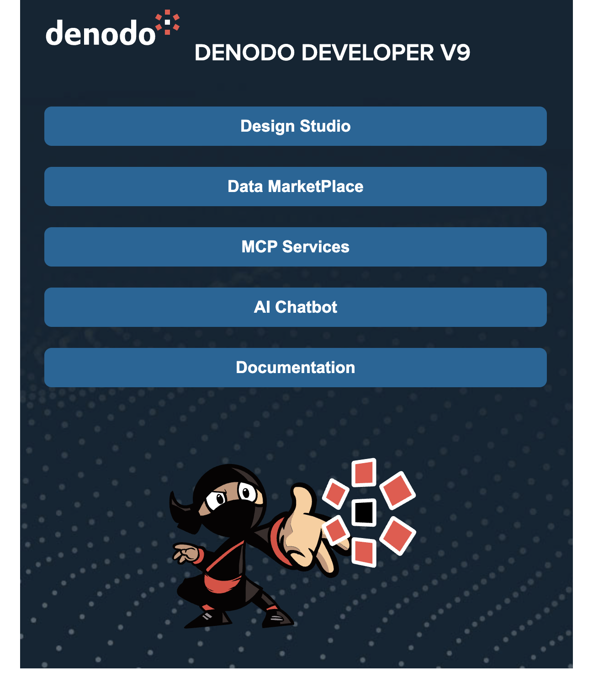

# denodo-oneclick
Denodo developer one click install for Docker on Windows and Linux.

This package automatically deploys the following Denodo components:
* Denodo Virtual Data Port
* Design Studio
* Data Marketplace
* AI-SDK API and Chatbot
* AI-SDK MCP Server
* Denodo VDP MCP Server
* Other components:
  * PostgreSQL DB
  * Nginx HTTP Server
  
Following a successful deployment you have access to a landing webpage with link to all the install components.




## Usage

To install Denodo Developper you just need to follow those steaps
* Regirster with Denodo Support
* Obtain your Denodo Support Client ID
* Obtain your Denodo Support Secret
* Download your Denodo License

You can then run the following command to install your own local container image of Denodo Developper by running the following command (change the parameters first)

> **_NOTE:_**  You must have Docker priorly installed on your machine

> **_NOTE:_** Give Docker at least 6 GB of memory (8 GB recommended). VDP Server, Design Studio, Data Marketplace, and the MCP server all run as separate concurrent Java processes, and running them under too little memory causes them to crash shortly after starting (often showing as a 502 from nginx) rather than a clean out-of-memory error. This is especially easy to hit with [Colima](https://github.com/abiosoft/colima), whose default profile only allocates 2 GB - increase it with `colima stop && colima start --memory 8 --cpu 4`, or by setting `memory: 8` in `~/.colima/default/colima.yaml`. On Docker Desktop, adjust it under Settings → Resources → Memory.

### Linux / MacOS

```zsh
curl -fsSL https://raw.githubusercontent.com/vfagesgo/denodo-oneclick/main/install.sh | bash  -s -- \
--DENODO_SUPPORT_CI <Support_CI> \
--DENODO_SUPPORT_SECRET <Support_CI> \
--DENODO_LIC <Path to your Denodo license file>
```

If you already have this repository checked out locally, you can run the script directly instead of piping it from GitHub:

```zsh
./install.sh \
  --DENODO_SUPPORT_CI <Support_CI> \
  --DENODO_SUPPORT_SECRET <Support_Secret> \
  --DENODO_LIC <Path to your Denodo license file>
```

### Windows

On Windows, use `install.ps1` from a PowerShell prompt. Docker Desktop's Linux container backend builds/runs the exact same image as the bash version.

> **_NOTE:_** Start Docker Desktop before running the script — it calls `docker` directly and fails immediately if the Docker engine isn't running.

PowerShell doesn't support piping a script straight into execution the way `curl | bash` does, so download it first, then run it. PowerShell also blocks running downloaded `.ps1` scripts by default, so bypass that for the current session with `Set-ExecutionPolicy`:

```powershell
Set-ExecutionPolicy -Scope Process -ExecutionPolicy Bypass

iwr -useb https://raw.githubusercontent.com/vfagesgo/denodo-oneclick/main/install.ps1 -OutFile install.ps1

.\install.ps1 -DENODO_SUPPORT_CI <Support_CI> -DENODO_SUPPORT_SECRET <Support_Secret> -DENODO_LIC <Path to your Denodo license file>
```

`-Scope Process` only relaxes the policy for the current PowerShell session, not your machine's overall setting.

If you already have this repository checked out locally, run `.\install.ps1 ...` directly instead (still preceded by the `Set-ExecutionPolicy` line above if needed).

### Next Steps 

The install runs in the background; the script automatically follows its logs in your terminal until you Ctrl-C (the container keeps running either way). Once it completes, Denodo is available at http://localhost. To reattach to the logs later:

## Options

### Mandatory parameters
- `--DENODO_SUPPORT_CI <value>`
- `--DENODO_SUPPORT_SECRET <value>`
- `--DENODO_LIC <path>` — path to the Denodo license file

### Optional overrides
Defaults come from `denodo_config.env`; pass any of these to override them:
- `--DENODO_UPDATE <value>` (default: `denodo-update-9.5.1`)
- `--DENODO_PG_USER <value>` (default: `denodo`)
- `--DENODO_PG_PWD <value>` (default: `password`)
- `--DENODO_VDP_PWD <value>` (default: `admin`)

### Optional (CLI only)
- `--CLOUDFLARE_TUNNEL_KEY <value>` — optional Cloudflare Tunnel token, if you want to expose the instance publicly. Each Cloudflare Tunnel has its own unique token; reusing one tunnel's token elsewhere just adds another connector to that same tunnel rather than creating a new one.
- `--mode <docker|local>` — default `docker`; `local` is not implemented yet
- `--reset` — remove any existing container and its volumes first, so the install starts truly from scratch instead of resuming. Use this when you need to change a value like `--DENODO_UPDATE` or `--CLOUDFLARE_TUNNEL_KEY`, since these are baked into the container when it's first created and aren't picked up again by a plain restart — only `--reset` (or `--upgrade` for `--DENODO_UPDATE`) applies a new value.

## Retrying a failed or interrupted install

Just re-run the same command. It resumes the existing container rather than starting over — downloaded archives, installed packages, and completed install steps are kept, so a retry picks up close to where it left off instead of redoing everything from scratch.

If you do want a totally clean install, add `--reset` to remove the existing container and its data first.

## Refreshing or upgrading an already-installed container

These act on the existing `denodo-oneclick` container in place — they don't rebuild the image or touch your data volume. Under the hood they pull the latest `denodo-oneclick` repo into the container and re-run part of its install script (`docker exec`, not `docker run`), so the container keeps running throughout except for the services it restarts.

```zsh
./install.sh --refresh
```
- `--refresh` — pulls the latest `denodo-oneclick` repo (nginx config, service definitions) into the running container and reapplies it, then restarts the Denodo services. Does **not** touch the installed Denodo platform, AI SDK, or MCP server, and needs no other parameters.

```zsh
./install.sh --upgrade --DENODO_SUPPORT_CI <Support_CI> --DENODO_SUPPORT_SECRET <Support_Secret>
```
- `--upgrade` — does everything `--refresh` does, and also: re-runs the Denodo platform installer if `--DENODO_UPDATE` (or its default in `denodo_config.env`) has changed since the last install, and always re-fetches and reinstalls the AI SDK and the Denodo MCP server. Needs `--DENODO_SUPPORT_CI`/`--DENODO_SUPPORT_SECRET` (used to fetch the update/MCP archives); pass `--DENODO_UPDATE <value>` too if you're upgrading to a specific platform version. The Denodo services are stopped before the platform installer runs (required by the installer) and restarted afterwards.

Both commands require a container from a previous install to already exist; they error out if none is found. Neither is currently available from `install.ps1` on Windows.

## Stopping and starting the container

The container is a normal Docker container, so the usual commands work directly:

```zsh
docker stop denodo-oneclick
docker start denodo-oneclick
```

`docker start` does **not** redo the install. On boot, the container checks for a marker left behind by the last successful install/upgrade; if it's there (and the underlying OS packages still look intact), it skips straight to just (re)starting PostgreSQL, nginx, the Denodo services, and the Cloudflare tunnel (if configured) — this is usually done within well under a minute. A full reinstall only happens automatically if that marker is missing, e.g. the very first start, or after `--reset`.

To watch it come back up:

```zsh
docker logs -f denodo-oneclick
```

`docker restart denodo-oneclick` is equivalent to a stop followed by a start, and is what `--upgrade`/`--refresh` use internally as part of their startup-race workaround (see above) — so seeing the container restart itself once after one of those commands is expected, not an error.

## Persistence

Install progress and data live in a single named Docker volume, so they survive the container being removed and recreated (for example after rebuilding the image):
- `denodo-oneclick-data` — mounted at `/data`; contains the repository checkout, the installed Denodo platform (including the AI SDK and MCP server), and the PostgreSQL database.

`--reset` removes both this volume and the container.

## Current status

The Docker install mode is fully working: it builds a Debian-based image, installs PostgreSQL, Java, the Denodo platform, the Denodo AI SDK, the Denodo MCP server, and nginx, then starts the Denodo services (and, if `--CLOUDFLARE_TUNNEL_KEY` is set, a Cloudflare Tunnel) and serves the application on port 80. Local (non-Docker) install mode is not implemented yet.
